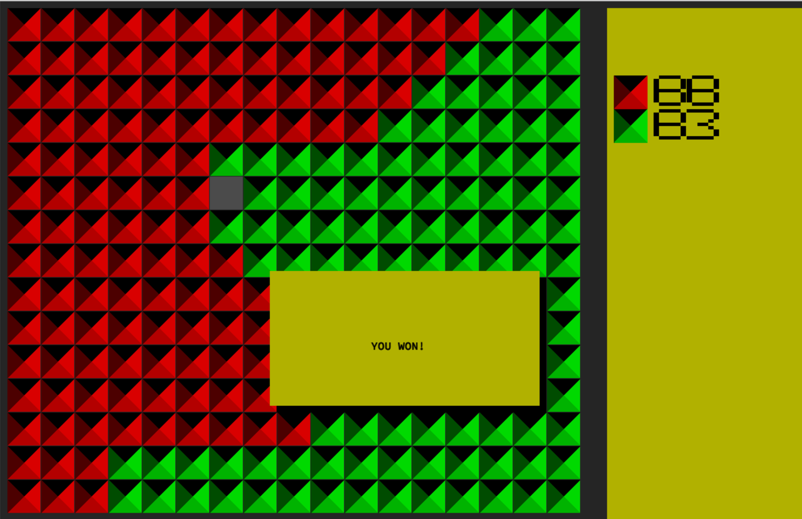

# Filler
An AI bot to play the filler game



Filler: 
```
Filler is an algorithmic game which consists in filling a grid of a known size in advance
with pieces of random size and shapes, without the pieces being stacked more than one
square above each other and without them exceeding the grid. If one of these conditions
is not met, the game stops.
```

## Install
```
git clone https://github.com/hakolao/filler.git && cd filler && make
```

## Run (Terminal)
```
./test/filler_vm -f test/maps/map02 -p1 ./ohakola.filler -p2 test/players/superjeannot.filler
```

## Run visually (UI)
```
./test/filler_vm -f test/maps/map02 -p1 "./ohakola.filler visual" -p2 test/players/superjeannot.filler
```

## Strategy
A very simplistic strategy where:
1. Check where token fits
2. Check which out of those locations is closest to enemy center of mass
3. Place there

Currently wins about 80% of games.

## Test script
Run test scripts with test maps and check results after. You'll see how many of the games were won.
```
# Run only on map00 6 games against test all test players where you are player 1
make test_quick_p1
# Run all maps 6 games against test all test players where you are player 1
make test_slow_p1
# Run only on map00 6 games against test all test players where you are player 2
make test_quick_p2
# Run all maps 6 games against test all test players where you are player 2
make test_slow_p2
```